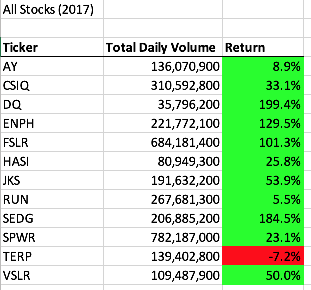
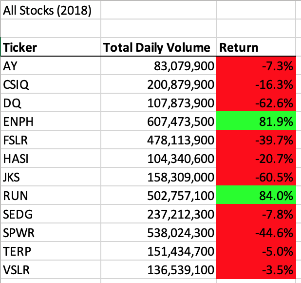
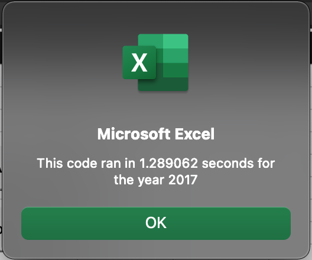
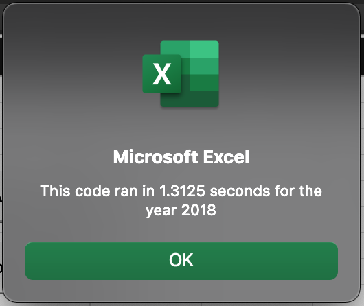
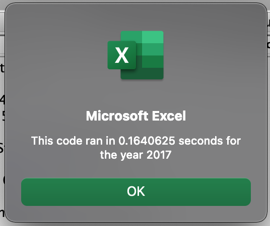
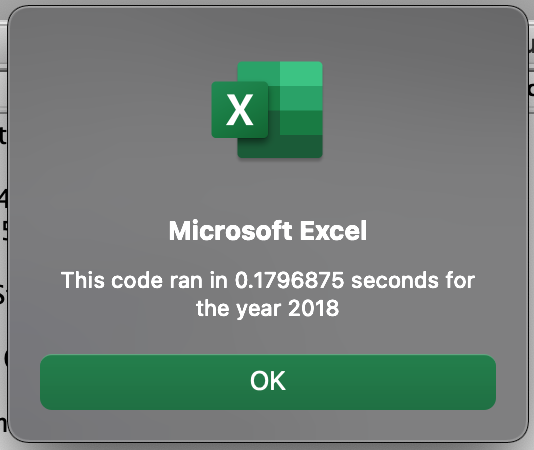

# **Green Energy Stocks Analyses**

## Overview of Project
### *Purpose*
My friend Steve’s parents were interested in investing in DAQO New Energy Corporation but had not done any research on the company. Steve had asked me to help him analyze this stock, as well as 11 other green energy stocks in 2018 based on total volume and yearly return to provide an informative opinion to his parents. Now, Steve would like to expand the dataset to include the entire stock market over the last few years to conduct more research. As such, I will refactor my prior code so that it can loop through thousands of stocks while still running in a short amount of time. 

## Resources
Data Source: VBA_Challenge.xlsm, green_stocks.xlsm

Software: Microsoft Excel 16.48, VBA

## Refactoring
I was provided with a partial code to refactor based on my previous analyses. The code was as follows: 
```
Sub AllStocksAnalysisRefactored()
    Dim startTime As Single
    Dim endTime  As Single

    yearValue = InputBox("What year would you like to run the analysis on?")

    startTime = Timer
    
    'Format the output sheet on All Stocks Analysis worksheet
    Worksheets("All Stocks Analysis").Activate
    
    Range("A1").Value = "All Stocks (" + yearValue + ")"
    
    'Create a header row
    Cells(3, 1).Value = "Ticker"
    Cells(3, 2).Value = "Total Daily Volume"
    Cells(3, 3).Value = "Return"

    'Initialize array of all tickers
    Dim tickers(12) As String
    
    tickers(0) = "AY"
    tickers(1) = "CSIQ"
    tickers(2) = "DQ"
    tickers(3) = "ENPH"
    tickers(4) = "FSLR"
    tickers(5) = "HASI"
    tickers(6) = "JKS"
    tickers(7) = "RUN"
    tickers(8) = "SEDG"
    tickers(9) = "SPWR"
    tickers(10) = "TERP"
    tickers(11) = "VSLR"
    
    'Activate data worksheet
    Worksheets(yearValue).Activate
    
    'Get the number of rows to loop over
    RowCount = Cells(Rows.Count, "A").End(xlUp).Row
    
    '1a) Create a ticker Index
    

    '1b) Create three output arrays   
    
    
    ''2a) Create a for loop to initialize the tickerVolumes to zero. 
    
        
    ''2b) Loop over all the rows in the spreadsheet. 
    For i = 2 To RowCount
    
        '3a) Increase volume for current ticker
        
        
        '3b) Check if the current row is the first row with the selected tickerIndex.
        'If  Then
           
        'End If
        
        '3c) check if the current row is the last row with the selected ticker
         'If the next row’s ticker doesn’t match, increase the tickerIndex.
        'If  Then
           
            '3d Increase the tickerIndex.
            
        'End If
    
    Next i
    
    '4) Loop through your arrays to output the Ticker, Total Daily Volume, and Return.
    For i = 0 To 11
        
        Worksheets("All Stocks Analysis").Activate
        
    Next i
    
    'Formatting
    Worksheets("All Stocks Analysis").Activate
    Range("A3:C3").Font.FontStyle = "Bold"
    Range("A3:C3").Borders(xlEdgeBottom).LineStyle = xlContinuous
    Range("B4:B15").NumberFormat = "#,##0"
    Range("C4:C15").NumberFormat = "0.0%"
    Columns("B").AutoFit

    dataRowStart = 4
    dataRowEnd = 15

    For i = dataRowStart To dataRowEnd
        
        If Cells(i, 3) > 0 Then
            
            Cells(i, 3).Interior.Color = vbGreen
            
        Else
        
            Cells(i, 3).Interior.Color = vbRed
            
        End If
        
    Next i
 
    endTime = Timer
    MsgBox "This code ran in " & (endTime - startTime) & " seconds for the year " & (yearValue)

End Sub
```
### *Step 1a*
To start, I created a tickerIndex and set it equal to zero: 
```
tickerIndex = 0
```
### *Step 1b*
I then created three output arrays, including “tickerVolumes” as a Long data type, “tickerStartingPrices” as a Single data type, and “tickerEndingPrices” as a Single data type:
```
    Dim tickerVolumes(12) As Long
    Dim tickerStartingPrices(12) As Single
    Dim tickerEndingPrices(12) As Single
```
### *Step 2a*
I created a for loop to go through all the tickers, assigning a ticker from the array to a ticker variable and initializing the “tickervolumes” to zero:
```
    For i = 0 To 11
        tickerVolumes(i) = 0
    Next i
```
### *Step 2b*
Next, I created a for loop that will loop over all the rows in the spreadsheet by setting the integer to equal row 2 up until our “RowCount”/number of cells in our worksheet:
```
For i = 2 To RowCount
```
### *Step 3a*
Inside the for loop, I wrote a script to increase the ticker volume for the current stock ticker by using the “tickerVariable” as the index: 
```
       tickerVolumes(tickerIndex) = tickerVolumes(tickerIndex) + Cells(i, 8).Value
```
### *Step 3b*
I set the code to loop through all the rows and check if the current row is the first row with the selected tickerIndex to set the ticker staring prices. To determine the latter, I created conditions using logical operations to check if the ticker in the current row is the tickerIndex and if the ticker in the previous row is not. Price data was located in the sixth column, and thus starting price was located in Cells(i, 6). The following code was inputted:
```
        If Cells(i, 1).Value = tickers(tickerIndex) And Cells(i - 1, 1).Value <> tickers(tickerIndex) Then
            tickerStartingPrices(tickerIndex) = Cells(i, 6).Value
        End If
```
### *Step 3c*
I used the same design pattern to calculate the ticker ending price, using conditions to check that the current row’s ticker is the selected tickerIndex and that the next row’s ticker is not as follows: 
```
        If Cells(i + 1, 1).Value <> tickers(tickerIndex) And Cells(i, 1).Value = tickers(tickerIndex) Then
            tickerEndingPrices(tickerIndex) = Cells(i, 6).Value
```
### *Step 3d*
Next, I wrote a script to increase the tickerIndex if the next row’s ticker doesn’t match the previous row’s ticker:
```
        tickerIndex = tickerIndex + 1
        End If
    
    Next i
```
### *Step 4*
Finally, I used a for loop to loop through my arrays (i.e., tickers, tickerVolumes, tickerStartingPrices, and tickerEndingPrices) to output the “Ticker”, “Total Daily Volume”, and “Return” columns within my worksheet. The code was to place the output starting on row 4 and adding the integer so that each ticker prints on a new row: 
```
    For i = 0 To 11
        Cells(4 + i, 1).Value = tickers(i)
        Cells(4 + i, 2).Value = tickerVolumes(i)
        Cells(4 + i, 3).Value = (tickerEndingPrices(i) / tickerStartingPrices(i)) - 1

    Next i
```
The full refactored code looked as follows:
```
Sub AllStocksAnalysisRefactored()

    Dim startTime As Single
    Dim endTime  As Single

    yearValue = InputBox("What year would you like to run the analysis on?")

    startTime = Timer
    
    'Format the output sheet on All Stocks Analysis worksheet
    Worksheets("All Stocks Analysis").Activate
    
    Range("A1").Value = "All Stocks (" + yearValue + ")"
    
    'Create a header row
    Cells(3, 1).Value = "Ticker"
    Cells(3, 2).Value = "Total Daily Volume"
    Cells(3, 3).Value = "Return"

    'Initialize array of all tickers
    Dim tickers(12) As String
    
    tickers(0) = "AY"
    tickers(1) = "CSIQ"
    tickers(2) = "DQ"
    tickers(3) = "ENPH"
    tickers(4) = "FSLR"
    tickers(5) = "HASI"
    tickers(6) = "JKS"
    tickers(7) = "RUN"
    tickers(8) = "SEDG"
    tickers(9) = "SPWR"
    tickers(10) = "TERP"
    tickers(11) = "VSLR"
    
    'Activate data worksheet
    Worksheets(yearValue).Activate
    
    'Get the number of rows to loop over
    RowCount = Cells(Rows.Count, "A").End(xlUp).row
    
    'Create a ticker Index
    tickerIndex = 0

    'Create three output arrays
    Dim tickerVolumes(12) As Long
    Dim tickerStartingPrices(12) As Single
    Dim tickerEndingPrices(12) As Single
    
    'Create a for loop to initialize the tickerVolumes to zero.
    For i = 0 To 11
        tickerVolumes(i) = 0
    Next i
        
    'Loop over all the rows in the spreadsheet.
    For i = 2 To RowCount
    
    'Increase volume for current ticker
        tickerVolumes(tickerIndex) = tickerVolumes(tickerIndex) + Cells(i, 8).Value

    'Check if the current row is the first row with the selected tickerIndex.
        If Cells(i, 1).Value = tickers(tickerIndex) And Cells(i - 1, 1).Value <> tickers(tickerIndex) Then
            tickerStartingPrices(tickerIndex) = Cells(i, 6).Value
        End If
        
    'Check if the current row is the last row with the selected ticker
         'If the next row’s ticker doesn’t match, increase the tickerIndex.
        If Cells(i + 1, 1).Value <> tickers(tickerIndex) And Cells(i, 1).Value = tickers(tickerIndex) Then
            tickerEndingPrices(tickerIndex) = Cells(i, 6).Value
        
    'Increase the tickerIndex.
            tickerIndex = tickerIndex + 1
        End If
    
    Next i
    
    'Loop through arrays to output the Ticker, Total Daily Volume, and Return.
    Worksheets("All Stocks Analysis").Activate
    For i = 0 To 11
        Cells(4 + i, 1).Value = tickers(i)
        Cells(4 + i, 2).Value = tickerVolumes(i)
        Cells(4 + i, 3).Value = (tickerEndingPrices(i) / tickerStartingPrices(i)) - 1

    Next i
    
    'Formatting
    Worksheets("All Stocks Analysis").Activate
    Range("A3:C3").Font.FontStyle = "Bold"
    Range("A3:C3").Borders(xlEdgeBottom).LineStyle = xlContinuous
    Range("B4:B15").NumberFormat = "#,##0"
    Range("C4:C15").NumberFormat = "0.0%"
    Columns("B").AutoFit

    dataRowStart = 4
    dataRowEnd = 15

    For i = dataRowStart To dataRowEnd
        
        If Cells(i, 3) > 0 Then
            
            Cells(i, 3).Interior.Color = vbGreen
            
        Else
        
            Cells(i, 3).Interior.Color = vbRed
            
        End If
        
    Next i
 
    endTime = Timer
    MsgBox "This code ran in " & (endTime - startTime) & " seconds for the year " & (yearValue)

End Sub
```

## Results
### *Stock Performance*




In 2017, DQ had a total volume of 35,796,200 and a return of almost 200%. However, DQ’s return dropped about 63% in 2018 and their total volume was 107,873,900. Most green energy stocks had positive returns in 2017 and negative returns in 2018. Though, two stocks, ENPH and RUN, show positive returns in both years. ENPH increased by almost 130% in 2017 and 82% in 2018; total volume additionally increased from 221,772,100 in 2017 to 607,473,500 in 2018. RUN increased by 5.5% in 2017 and 84.0% in 2018; total volume increased from 267,681,300 in 2017 to 502,757,100 in 2018.

### *Execution Times*
Original Script:




Refactored Script:




The original script ran in 1.289062 and 1.3125 seconds for 2017 and 2018, respectively. Refactoring the script reduced the execution times by over 1 second each to 0.1640625 and 0.1796875 seconds for 2017 and 2018, respectively. 

## Summary
### *Advantages and Disadvantages of Refactoring Code*
Refactoring allows a code to become more efficient, subsequently allowing for faster executions of analyses of large datasets. Additionally, creating a simpler code allows for easier detection of errors in the syntax if any should appear when running the code. 

However, refactoring code may not always be beneficial, as it can take more time to refactor the code than the amount of execution time you would save in comparison to the original code. 

### *Advantages and Disadvantages of the Original and Refactored VBA Script*
Refactoring of the original code for this challenge only saved 1 second of time for execution of analyses for each year, while the process of refactoring the code took much longer, thus not making the refactoring truly more efficient. Though, refactoring the code did help to simplify it, making it easier to understand for future users. 
